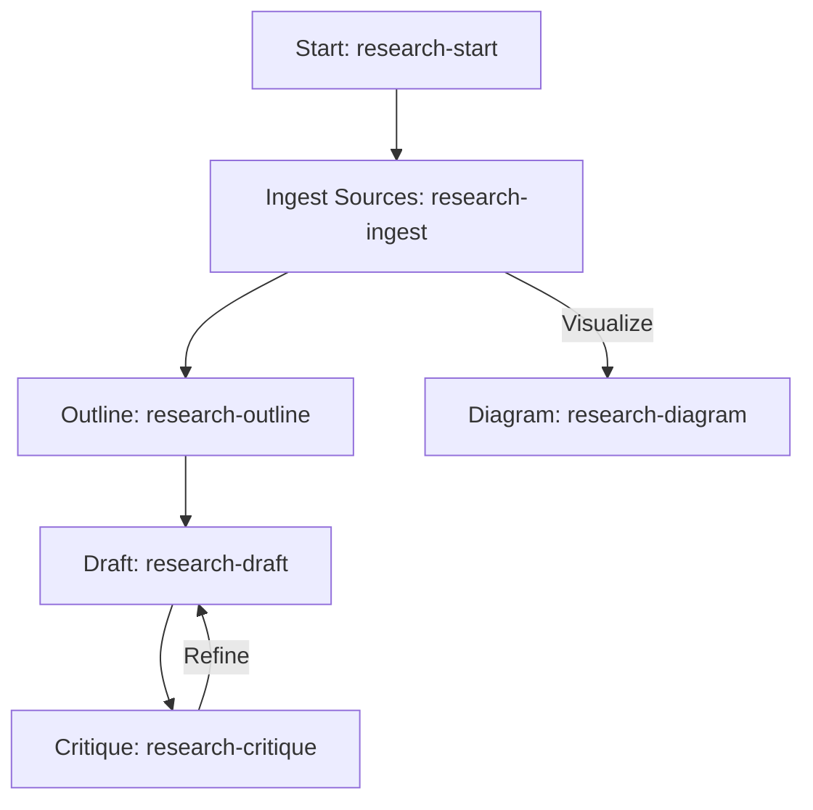

# Research Station Template

This is a GitHub Template Repository designed to act as a master "cookie cutter" for spinning up new, fully configured research environments in seconds, optimized for GitHub Copilot.

## Features

*   **Zero-Config Start:** Ready to use immediately with sensible defaults.
*   **Data Hygiene:** Strict separation of `sources` (inputs) and `drafts` (outputs) to prevent AI hallucination loops.
*   **Persona-Based Writing:** Configurable personas (Executive, Academic, etc.) controlled via `USER_SETTINGS.md`.
*   **Automated Workflow:** VS Code snippets (`research-start`, `research-draft`) automate context management and file naming.
*   **Safety Guards:** Built-in protocols prevent code generation, enforce citation rules, and protect system configuration files.

## Prerequisites

Before using this template, ensure you have:
1.  **Visual Studio Code** installed.
2.  **GitHub Copilot Chat** extension installed and active.
3.  (Optional) **Markdown All in One** extension for better writing experience.

## Directory Structure

*   `USER_SETTINGS.md`: The main config file. Edit this to set your Active Persona and Format.
*   `PROMPTS.md`: The centralized library of research prompts (Ingest, Outline, Draft, Critique).
*   `workspace/`: The main work area.
    *   `sources/`: Place all source materials (PDFs, docs) here. Includes a guidance `README.md`.
    *   `drafts/`: Generated drafts go here. Includes a hygiene warning `README.md`.
*   `.github/copilot-instructions.md`: The "Brain" (Protocol) for Copilot. Enforces rules like "No Code" and "System Integrity".
*   `.vscode/research.code-snippets`: Pre-defined prompts accessible via snippets.
*   `.gitignore`: Prevents binary source files (PDF, DOCX) from bloating the repo.

## How to Use This Template

1.  **Enable Template Mode (if not already done)**:
    *   Go to the repository Settings on GitHub.
    *   Check the box "Template repository".

2.  **Generate a New Project**:
    *   Click "Use this template" > "Create a new repository".
    *   Name it (e.g., `research-quantum-computing`).
    *   Clone it to VS Code.

## Workflow

1.  **Initialization**: Open the **Copilot Chat** panel. Type `research-start` (select the snippet from the dropdown) to generate a structured `RESEARCH_PLAN.md`.
2.  **Ingestion**: Upload documents (PDF, DOCX, TXT) to the `workspace/sources/` folder.
3.  **Configuration**: Open `USER_SETTINGS.md`. Uncomment your desired **Active Persona** and **Active Format** (remove the `<!--` and `-->` tags surrounding the block). Ensure only one is active at a time.
4.  **Analysis**: In Chat, type `research-ingest` to identify key themes and conflicts in your sources.
5.  **Drafting**:
    *   Type `research-outline` to structure your thoughts based on the sources.
    *   Type `research-draft` to write content. The AI will apply your active style and append to your open file.
6.  **Refinement**:
    *   Type `research-critique` to stress-test your active draft against the sources.
    *   Type `research-diagram` to generate Mermaid.js charts visualizing complex relationships.

## Quick Start Example

**Goal:** Write an Executive Summary on Quantum Computing.

1.  **Setup:** Clone repo. Drop `quantum-report.pdf` into `workspace/sources/`.
2.  **Config:** In `USER_SETTINGS.md`, ensure **Option 1: Executive** is active. Save the file.
3.  **Chat:** Type `research-start`. Copilot creates `[Date]-Research-Plan.md`.
4.  **Chat:** Type `research-ingest`. Copilot summarizes key findings from the PDF.
5.  **Chat:** Type `research-draft`. Copilot writes a concise, BLUF-style executive summary in your draft file.

## Configuration Options

You can toggle between these pre-defined styles in `USER_SETTINGS.md`:

*   **Personas:** Executive (Default), Academic/Technical, Public Blog Post.
*   **Formats:** Email (Default), Reference Document.

## Best Practices

*   **One Topic Per Repo:** Keep repositories scoped to a single research topic to maintain context clarity.
*   **Source Limits:** For best performance, keep individual source files under 10MB.
*   **Review Settings:** Before starting a new draft, always double-check `USER_SETTINGS.md` to ensure the correct Persona is active.

## Extending the Template

To add your own custom Personas:
1.  Open `USER_SETTINGS.md`.
2.  Copy an existing block (e.g., the Executive block).
3.  Modify the **Role**, **Tone**, and **Constraints**.
4.  (Advanced) To modify core logic (e.g., citation rules), edit `.github/copilot-instructions.md`.

## Troubleshooting

*   **AI is Hallucinating:** Check `workspace/sources/`. Are your source files there? The AI strictly adheres to the "Citation Rule" and will not invent facts if sources are missing.
*   **Context Amnesia:** If the AI "forgets" your Outline or Plan, ensure the file is **open** in your editor. While the system can read the workspace, having the file open guarantees it is in the immediate context window.
*   **Wrong Tone:** Check `USER_SETTINGS.md`. Did you accidentally leave two personas uncommented? Ensure only one is active.
*   **"System Integrity" Error:** You tried to ask the AI to modify `PROMPTS.md` or `USER_SETTINGS.md`. The protocol strictly forbids this to prevent accidental breakage. Edit these files manually.

## License

MIT
